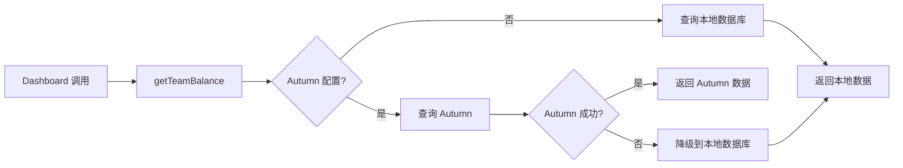
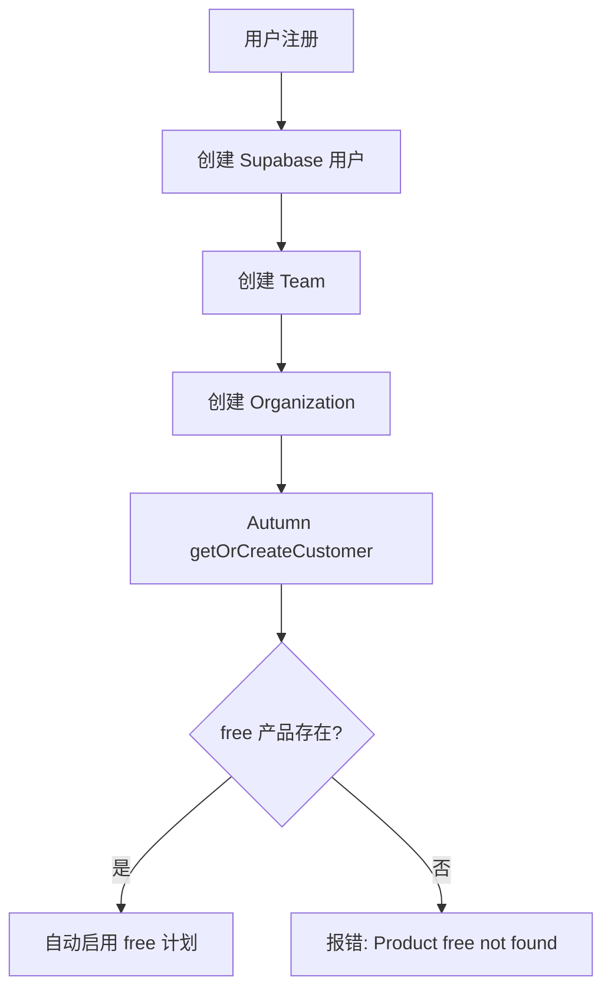

# Autumn 计费服务配置指南

## 一、Autumn 是什么？

Autumn 是一个计费/配额管理系统，用于：
- 跟踪 API 使用情况
- 管理信用余额
- 检查配额限制
- 记录历史使用数据
- 与 Stripe 集成处理订阅

## 二、Stripe 与 Autumn 的关系

| 系统 | 职责 | 数据流向 |
|------|------|---------|
| **Stripe** | 支付处理、订阅管理、发票 | 用户付款 → Stripe → 通知 Autumn |
| **Autumn** | 配额管理、使用跟踪、余额检查 | API 调用 → Autumn → 检查配额 → 扣费 |

**关键区别：**
- Stripe 处理"钱"的流向
- Autumn 处理"配额"的流向

## 三、为什么需要配置 free 层级？

### 3.1 代码中的硬编码

在 `apps/api/src/services/autumn/usage.ts` 第 220 行：

```typescript
const customer = await autumnClient.customers.getOrCreate({
  customerId: orgId,
  autoEnablePlanId: "free",  // 硬编码为 "free"
});
```

在 `apps/api/src/services/autumn/autumn.service.ts` 第 93 行：

```typescript
const AUTUMN_DEFAULT_PLAN_ID = "free";  // 默认计划 ID
```

### 3.2 工作流程

1. 新用户注册时，系统会自动在 Autumn 中创建客户
2. 如果客户不存在，会自动启用 `autoEnablePlanId` 指定的计划
3. 由于代码硬编码为 `"free"`，Autumn 必须存在名为 `free` 的产品

### 3.3 错误原因

当前错误：`Product free not found`

**原因：** Autumn 中没有配置名为 `free` 的产品/计划

## 四、Autumn 配置清单

### 4.1 必需的环境变量

在 `.env` 文件中配置：

```bash
# Autumn 计费服务（必需）
AUTUMN_SECRET_KEY=your_autumn_secret_key

# Autumn 实验开关（可选，默认 false）
AUTUMN_EXPERIMENT=true
AUTUMN_EXPERIMENT_PERCENT=100

# Autumn 检查开关（可选）
AUTUMN_CHECK_ENABLED=true
AUTUMN_CHECK_DRY_RUN=false
AUTUMN_CHECK_EXPERIMENT_PERCENT=100
```

### 4.2 自动化配置（推荐）

为了简化配置流程并确保一致性，项目提供了自动化脚本 `init-billing-services.py`，可以从 Supabase 的 `plan_configs` 表自动配置 Autumn 和 Stripe。

#### 使用自动化脚本

```bash
# 查看将要执行的操作（不实际修改）
python scripts/init-billing-services.py --dry-run

# 完整配置 Autumn 和 Stripe
python scripts/init-billing-services.py

# 仅配置 Autumn
python scripts/init-billing-services.py --autumn-only

# 仅配置 Stripe
python scripts/init-billing-services.py --stripe-only

# 如果遇到 SSL 错误，尝试禁用 SSL 验证
python scripts/init-billing-services.py --no-verify-ssl
```

**环境变量要求：**
- `SUPABASE_POSTGRES_HOST` - Supabase PostgreSQL 主机
- `SUPABASE_POSTGRES_USER` - Supabase PostgreSQL 用户名
- `SUPABASE_POSTGRES_PASSWORD` - Supabase PostgreSQL 密码
- `AUTUMN_SECRET_KEY` - Autumn API 密钥
- `STRIPE_SECRET_KEY` - Stripe API 密钥

**脚本功能：**
- 从 Supabase 读取 `plan_configs` 表的所有计划
- 自动在 Autumn 中创建产品、特性（CREDITS、TEAM）和计划配额
- 自动在 Stripe 中创建产品和价格（月付/年付）
- 支持幂等性（重复执行安全，已存在的会被跳过或更新）
- 支持增量更新（新增计划时只需运行脚本）

**价格配置：**
脚本内置了默认价格映射（可在脚本中修改）：
- free: $0
- hobby: $20/月, $200/年
- standard: $50/月, $500/年
- growth: $200/月, $2,000/年
- scale: $500/月, $5,000/年

**SSL 错误处理：**
如果遇到 `[SSL] record layer failure` 错误，这通常是由于：
1. 网络代理干扰 TLS 握手
2. Python 3.13 SSL/TLS 兼容性问题
3. 企业防火墙或 VPN 设置

**解决方案：**
- 使用 `--no-verify-ssl` 标志禁用 SSL 验证（可能不适用于所有情况）
- 使用 Autumn 和 Stripe 的仪表板手动配置（见下文的手动配置部分）
- 尝试从不同的网络环境运行
- 如果问题持续，考虑使用 Python 3.11 或 3.12

### 4.3 手动配置（可选）

如果需要手动配置，请按照以下步骤操作：

#### 步骤 1：登录 Autumn Dashboard

访问 Autumn Dashboard（需要 Autumn 账户）

#### 步骤 2：创建产品（Products）

在 Autumn 中创建以下产品：

| 产品 ID | 名称 | 描述 | 是否必需 |
|---------|------|------|---------|
| `free` | Free Plan | 免费层级 | **必需** |
| `hobby` | Hobby Plan | 爱好者层级 | 推荐 |
| `standard` | Standard Plan | 标准层级 | 推荐 |
| `growth` | Growth Plan | 成长层级 | 推荐 |
| `scale` | Scale Plan | 扩展层级 | 推荐 |

**重要：** `free` 产品必须存在，否则新用户注册时会报错。

#### 步骤 3：配置产品特性（Features）

为每个产品配置以下特性：

| 特性 ID | 类型 | 说明 |
|---------|------|------|
| `CREDITS` | 数值 | 信用额度 |
| `TEAM` | 计数 | 团队数量 |
| `REQUESTS` | 计数 | API 请求次数 |

#### 步骤 4：配置计划配额（Plan Quotas）

为每个计划配置配额：

**free 计划：**
- CREDITS: 1000
- TEAM: 1
- REQUESTS: 无限制

**hobby 计划：**
- CREDITS: 10000
- TEAM: 10
- REQUESTS: 无限制

**standard 计划：**
- CREDITS: 100000
- TEAM: 25
- REQUESTS: 无限制

**growth 计划：**
- CREDITS: 500000
- TEAM: 50
- REQUESTS: 无限制

**scale 计划：**
- CREDITS: 1000000
- TEAM: 100
- REQUESTS: 无限制

#### 步骤 5：配置 Stripe 集成（可选但推荐）

在 Autumn 中配置 Stripe webhook：

1. 获取 Autumn 的 webhook URL
2. 在 Stripe Dashboard 中配置 webhook
3. 监听事件：
   - `customer.subscription.created`
   - `customer.subscription.updated`
   - `customer.subscription.deleted`
   - `invoice.paid`

### 4.3 数据库配置（Supabase）

确保 `plan_configs` 表包含正确的计划配置：

```sql
-- 检查现有计划
SELECT * FROM public.plan_configs;

-- 如果缺失，插入所有计划
INSERT INTO public.plan_configs (name, max_credits, max_concurrent_requests, max_team_members, features) 
VALUES 
  ('free', 1000, 10, 5, '{"stealth_proxy": false, "open_sandbox": false}'::jsonb),
  ('hobby', 10000, 50, 10, '{"stealth_proxy": true, "open_sandbox": true}'::jsonb),
  ('standard', 100000, 100, 25, '{"stealth_proxy": true, "open_sandbox": true, "priority_support": true}'::jsonb),
  ('growth', 500000, 250, 50, '{"stealth_proxy": true, "open_sandbox": true, "priority_support": true}'::jsonb),
  ('scale', 1000000, 500, 100, '{"stealth_proxy": true, "open_sandbox": true, "priority_support": true, "dedicated_support": true}'::jsonb)
ON CONFLICT (name) DO NOTHING;
```

**现有层级迁移：**

如果数据库中已有 `starter` 层级，需要迁移到 `hobby`：

```sql
-- 重命名 starter 为 hobby
UPDATE public.plan_configs 
SET name = 'hobby' 
WHERE name = 'starter';

-- 如果需要保留原数据，可以先创建新的 hobby 层级，然后手动迁移用户
-- INSERT INTO public.plan_configs (name, max_credits, max_concurrent_requests, max_team_members, features)
-- SELECT 'hobby', max_credits, max_concurrent_requests, max_team_members, features
-- FROM public.plan_configs WHERE name = 'starter';
```

## 五、Autumn API 调用流程

### 5.1 余额查询流程



### 5.2 新用户注册流程



## 六、故障排查

### 6.1 错误：Product free not found

**原因：** Autumn 中没有配置 `free` 产品

**解决：**
1. 登录 Autumn Dashboard
2. 创建名为 `free` 的产品
3. 配置 CREDITS 特性（默认 1000）

### 6.2 错误：AUTUMN_SECRET_KEY is not set

**原因：** 环境变量未配置

**解决：**
```bash
# 在 .env 文件中添加
AUTUMN_SECRET_KEY=your_autumn_secret_key
```

### 6.3 错误：Autumn client is not configured

**原因：** Autumn 客户端初始化失败

**解决：**
1. 检查 `AUTUMN_SECRET_KEY` 是否正确
2. 检查网络连接
3. 检查 Autumn 服务是否可用

### 6.4 Dashboard 显示 500 错误

**原因：** Autumn 查询失败，但代码没有正确降级

**解决：**
- 已在 `apps/api/src/controllers/dashboard/credit-usage.ts` 中添加降级逻辑
- 如果 Autumn 失败，会自动使用本地数据库

## 七、配置检查清单

- [ ] 配置 `AUTUMN_SECRET_KEY` 环境变量
- [ ] 在 Autumn Dashboard 中创建 `free` 产品
- [ ] 在 Autumn Dashboard 中配置 CREDITS 特性
- [ ] 在 Autumn Dashboard 中创建其他计划（可选）
- [ ] 在 Supabase 中检查 `plan_configs` 表
- [ ] 确保 `plan_configs` 表包含 `free` 计划
- [ ] 测试新用户注册流程
- [ ] 测试余额查询功能
- [ ] 配置 Stripe webhook（可选）

## 八、快速修复当前问题

### 立即修复：在 Autumn 中创建 free 产品

1. 登录 Autumn Dashboard
2. 导航到 Products 页面
3. 创建新产品：
   - **Product ID:** `free`
   - **Name:** Free Plan
   - **Description:** Free tier for new users
4. 添加 Feature：
   - **Feature ID:** `CREDITS`
   - **Type:** `numeric`
   - **Default:** `1000`
5. 保存配置

### 验证修复

```bash
# 重启 API 服务
docker compose restart api

# 检查日志
docker compose logs api | grep -i autumn
```

## 九、长期建议

### 9.1 移除硬编码

修改代码，使 `autoEnablePlanId` 可配置：

```typescript
// 在 config.ts 中添加
AUTUMN_DEFAULT_PLAN_ID: z.string().default("free"),

// 在 autumn.service.ts 中使用
const AUTUMN_DEFAULT_PLAN_ID = config.AUTUMN_DEFAULT_PLAN_ID;
```

### 9.2 增强降级逻辑

在所有 Autumn 调用处添加降级逻辑，确保 Autumn 不可用时系统仍能工作。

### 9.3 监控和告警

添加 Autumn API 调用的监控和告警，及时发现计费服务异常。

---

## 十、新增层级操作指南

### 10.1 概述

当需要新增一个订阅层级时，需要同步更新以下三个系统：

1. **Supabase** - 添加新的 plan_configs 记录
2. **Autumn** - 创建新的计划/配额
3. **Stripe** - 创建新的价格/产品

### 10.2 推荐方式：使用自动化脚本

使用自动化脚本可以一键完成所有配置，确保一致性并避免手动错误。

#### 步骤 1：在 Supabase 中添加新层级

```sql
-- 插入新的 plan_config
INSERT INTO public.plan_configs (name, max_credits, max_concurrent_requests, max_team_members, features) 
VALUES 
  ('enterprise', 5000000, 1000, 200, '{"stealth_proxy": true, "open_sandbox": true, "priority_support": true, "dedicated_support": true, "custom_integration": true}'::jsonb)
ON CONFLICT (name) DO NOTHING;
```

#### 步骤 2：更新脚本中的价格映射

编辑 `scripts/init-billing-services.py`，在 `price_mapping` 字典中添加新层级的价格：

```python
price_mapping = {
    'free': 0,
    'hobby': 2000,
    'standard': 5000,
    'growth': 20000,
    'scale': 50000,
    'enterprise': 100000  # 新增
}
```

#### 步骤 3：运行自动化脚本

```bash
# 先查看将要执行的操作
python scripts/init-billing-services.py --dry-run

# 确认无误后执行
python scripts/init-billing-services.py
```

脚本会自动：
- 在 Autumn 中创建产品和配额
- 在 Stripe 中创建产品和价格（月付/年付）
- 跳过已存在的配置（幂等性）

#### 步骤 4：更新环境变量

脚本执行完成后，会输出 Stripe Price ID，将其添加到 `.env` 文件：

```bash
STRIPE_PRICE_ID_ENTERPRISE=price_xxx
STRIPE_PRICE_ID_ENTERPRISE_YEARLY=price_yyy
```

### 10.3 手动方式（可选）

如果需要手动配置，请按照以下步骤操作：

#### 步骤 1：在 Supabase 中添加新层级

```sql
-- 插入新的 plan_config
INSERT INTO public.plan_configs (name, max_credits, max_concurrent_requests, max_team_members, features) 
VALUES 
  ('enterprise', 5000000, 1000, 200, '{"stealth_proxy": true, "open_sandbox": true, "priority_support": true, "dedicated_support": true, "custom_integration": true}'::jsonb)
ON CONFLICT (name) DO NOTHING;
```

#### 步骤 2：在 Stripe 中创建新层级

1. 登录 Stripe Dashboard
2. 导航到 Products → Create product
3. 创建新产品（如 "Enterprise"）
4. 创建价格（月付/年付）
5. 复制 Price ID（如 `prod_xxx`）

#### 步骤 3：在 Autumn 中创建新层级

1. 登录 Autumn Dashboard
2. 导航到 Products → Create product
3. 创建产品：
   - **Product ID**: `enterprise`
   - **Name**: Enterprise Plan
4. 配置 Feature：
   - **Feature ID**: `CREDITS`
   - **Type**: `numeric`
   - **Default**: `5000000`
5. 配置配额：
   - CREDITS: 5000000
   - TEAM: 200
   - REQUESTS: 无限制

#### 步骤 4：更新环境变量

在 `.env` 文件中添加新的 Stripe Price ID：

```bash
STRIPE_PRICE_ID_ENTERPRISE=prod_xxx
STRIPE_PRICE_ID_ENTERPRISE_YEARLY=prod_yyy
```

#### 步骤 5：更新代码（如需要）

如果新层级有特殊的速率限制或功能，需要更新相关代码：

- `apps/api/src/services/rate-limiter.ts` - 添加新的速率限制配置
- `apps/api/src/lib/entities.ts` - 更新类型定义（如有新功能）

#### 步骤 6：测试验证

1. 创建测试用户，分配新层级
2. 验证 Autumn 配额是否正确
3. 验证 Stripe 订阅是否正常
4. 验证 API 速率限制是否生效

### 10.3 层级命名规范

建议遵循以下命名规范：

| 层级名称 | 描述 | Credits 范围 |
|---------|------|-------------|
| `free` | 免费层级 | 0-1000 |
| `hobby` | 爱好者 | 1000-10000 |
| `standard` | 标准 | 10000-100000 |
| `growth` | 成长 | 100000-500000 |
| `scale` | 扩展 | 500000-1000000 |
| `enterprise` | 企业 | 1000000+ |

### 10.4 注意事项

1. **ID 一致性**：确保 Stripe、Autumn、Supabase 中的层级 ID 一致
2. **向后兼容**：不要删除或重命名现有层级，只能新增
3. **数据迁移**：如果需要重命名层级，使用数据库迁移脚本
4. **测试先行**：在生产环境应用前，先在测试环境验证
